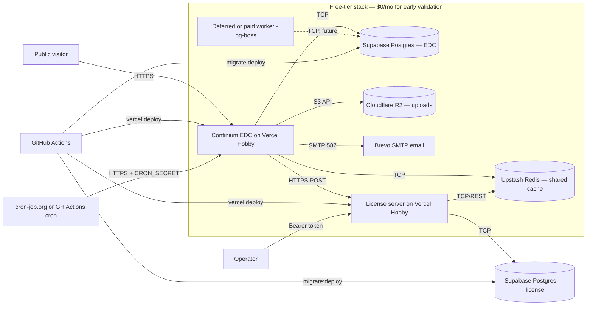

# Continium EDC — Production Deployment on Free Services

> **Status:** Planning document plus deployment-readiness code/config changes. Do not deploy from this document without the checklist pass.
> **Target:** Public-style early validation of Continium EDC + a separate private licensing server on free-tier infrastructure.
> **Author:** ntluong95 — 2026-05-18

---

## 1. Executive summary

This document describes how to deploy two repositories — the public AGPLv3 `continium-edc` and the private `continium-license-server` — using only free-tier cloud services. The goal is real, public, production-style URLs that anyone can register on and use, while preserving an upgrade path to paid infrastructure when the project graduates beyond demo/early-validation.

Recommended stack for $0/month **after red-team correction**:

| Component                       | Service                                                                           | Free allowance                                                                                             |
| ------------------------------- | --------------------------------------------------------------------------------- | ---------------------------------------------------------------------------------------------------------- |
| Continium EDC web               | **Vercel Hobby**                                                                  | Free for non-commercial personal use; SMTP 587 works with current `nodemailer` path; no always-on worker   |
| Continium EDC background worker | **Deferred for $0 demo**                                                          | No free always-on pg-boss worker in the selected stack; exclude worker-backed flows from public demo scope |
| Primary Postgres (pgvector)     | **Supabase Free**                                                                 | 500 MB / 5 GB egress; pauses after 1 week idle                                                             |
| License Postgres                | **Supabase Free (2nd project)**                                                   | Same                                                                                                       |
| Redis                           | **Upstash Free**                                                                  | 256 MB / 500K cmds/mo                                                                                      |
| Object storage                  | **Cloudflare R2**                                                                 | 10 GB / zero egress fees                                                                                   |
| Transactional email             | **Brevo SMTP**                                                                    | 300/day, no domain required                                                                                |
| License server compute          | **Vercel Hobby**                                                                  | Free for non-commercial personal use; current app runs as Node serverless, not Edge                        |
| Cron / scheduled triggers       | **GitHub Actions** + cron-job.org → `${WEBAPP_URL}/api/cron/*` with `CRON_SECRET` | Free                                                                                                       |
| Source / CI                     | **GitHub**                                                                        | Free                                                                                                       |
| Error tracking                  | **Sentry Developer**                                                              | 5K errors/mo                                                                                               |

**Red-team correction applied:** the original Render-first stack had two blockers: Render free web services cannot send SMTP, and Render Background Workers are not available on the free instance type. The user-confirmed $0 demo stack now uses **Vercel Hobby for the EDC app**, **Brevo SMTP**, and **deferred pg-boss worker flows**. The lowest practical production-like deployment with a real always-on worker still starts around **$7–14/mo**. **Expected first proper production upgrade: ~$80–120/mo** when traffic, uptime, or compliance require it.

**Critical warning** — Free services are for **testing, demos, and early validation only**. The system must **not** store identifiable patient data, PHI, or regulated clinical-trial data on free-tier infrastructure unless and until compliance, security, BAAs, backups, and access controls have been independently reviewed and signed off.

---

## 2. Target architecture (text diagram)



```
+-------------------+   HTTPS  +----------------------------+
| Public visitor    +--------->+  Continium EDC web (Vercel)|
+-------------------+          |  - Next.js 16              |
                               |  - apps/web                |
                               +-+--------+----+------------+
                                 |        |    |
                       TCP TLS   |        |    |  SMTP 587
                                 v        v    v
                    +-------------+ +------+ +------+
                    | Supabase    | |Upstash| |Brevo |
                    | Postgres    | |Redis  | |SMTP  |
                    | (pgvector)  | |       | |      |
                    +-------------+ +------+ +------+
                                 ^
                                 | TCP
                    +--------------------+
                    | Deferred/paid      |
                    | Worker — pg-boss   |
                    +--------------------+

  HTTPS + cached entitlements
+------------------------+
| Continium EDC ----->   |  +---------------------------+
|                        +->+ License server (Vercel)   |
+------------------------+  | apps/license-server (priv)|
                            +-----+---------+-----------+
                                  |         |
                                  v         v
                          +-------------+ +-----------+
                          | Supabase    | | Upstash   |
                          | Postgres    | | Redis     |
                          | (license)   | | (RL)      |
                          +-------------+ +-----------+
```

---

## 3. Repository strategy

Two repos. No code shared as a workspace package across them. Cross-repo contracts (Zod schemas only) live in the public repo's `packages/continium-licensing/src/contracts/` and are vendored (copied) into the private repo with a header comment marking the source.

### 3.1 Public — `continium-edc` (AGPLv3)

- License: AGPLv3 (same as Formbricks core).
- Visibility: public on GitHub.
- Contents:
  - `apps/web` — Next.js 16 EDC application.
  - `apps/worker` — pg-boss background worker.
  - `apps/storybook` — design-system playground.
  - `packages/*` — shared libraries (database, email, cache, types, continium-licensing, etc.).
  - `docs/*` — public documentation (excludes any EE-only docs).
  - `deployment/*` — these planning documents.
  - `docker/`, `charts/`, `migration/` — self-hosting helpers.
- **Removed**: `apps/license-server/`, `packages/license-generator/`, `apps/web/modules/ee/`.
- README must include Formbricks attribution and AGPL summary.

### 3.2 Private — `continium-license-server`

- License: "All rights reserved" or commercial placeholder.
- Visibility: **private** on GitHub.
- Contents: extracted from current monorepo's `apps/license-server/` flattened to repo root. License DB Prisma schema, admin token rotation, license key hashing, instance binding, audit logging.
- No AGPL code dependency; original clean-room code only.
- Vendored Zod schemas from the public repo for cross-service compatibility, kept in sync via PR review.

---

## 4. Licensing / legal separation

| Question                                                 | Answer                                                                                                                                                                                                                                                      |
| -------------------------------------------------------- | ----------------------------------------------------------------------------------------------------------------------------------------------------------------------------------------------------------------------------------------------------------- |
| Why two repos?                                           | AGPL viral clause makes derivative works AGPL. The license server should remain proprietary — keeping it in a separate private repo with **no AGPL code dependency** avoids the trigger.                                                                    |
| Can the license server import `@continium/licensing`?    | No — the license server vendors only the **Zod schemas** (data contracts), which are facts/interfaces and not copyrightable expressions. The vendored files carry an SPDX header attributing their source.                                                  |
| Can the public repo include the license-server source?   | No — separating physical repos enforces no-accidental-AGPL-tainting for the license-server code.                                                                                                                                                            |
| Is the Formbricks EE LICENSE attribution issue resolved? | No — `apps/web/modules/ee/LICENSE` claims Continium GmbH copyright on what appears to be Formbricks Enterprise code. Counsel review required before public publication. Tracked in `plans/260517-1605-continium-licensing-refactor/plan.md` open questions. |
| AGPL § 13 (network use) implications                     | The public EDC is AGPL. If deployed as SaaS, source must be offered to users. Add a "View source" link to the public EDC footer pointing at the public `continium-edc` GitHub repo.                                                                         |
| Does the license server need an AGPL license?            | No — it does not redistribute or interact directly with users; it only serves entitlement responses to the EDC. The EDC remains AGPL; the license server stays private.                                                                                     |

**Action item:** before publishing the public repo, resolve `apps/web/modules/ee/LICENSE` attribution with counsel.

---

## 5. Free service options comparison

### 5.1 Application hosting (Continium EDC)

| Service                  | Truly free?                         | Cold start               | RAM          | Bandwidth         | Custom domain    | Bg worker                                       | Verdict                                                            |
| ------------------------ | ----------------------------------- | ------------------------ | ------------ | ----------------- | ---------------- | ----------------------------------------------- | ------------------------------------------------------------------ |
| **Render** (Web Service) | Yes (750 hr/mo)                     | ~1 min after 15 min idle | 512 MB       | 5 GB/mo included  | Free, with HTTPS | ✗ no free Background Worker; SMTP ports blocked | Use only after email/worker plan corrected                         |
| **Vercel Hobby**         | Yes for non-commercial personal use | Low, serverless          | Serverless   | plan limits apply | Free             | ✗                                               | Better for HTTPS email APIs; no worker; commercial use not allowed |
| Railway                  | Trial only ($5 credit)              | None                     | Configurable | Unmetered         | Free             | ✓                                               | After trial: $5/mo                                                 |
| Fly.io                   | ✗ Removed 2024                      | —                        | —            | —                 | —                | —                                               | Skip                                                               |
| Koyeb                    | ✗ Compute removed 2026              | —                        | —            | —                 | —                | —                                               | Skip                                                               |
| Northflank Sandbox       | Yes                                 | None                     | Configurable | Limited           | Free             | ✓                                               | Sandbox-only; TOS says no production                               |
| Cloudflare Pages         | Yes                                 | None                     | Serverless   | Unmetered         | Free             | Workers required                                | Static only — won't run full Next.js                               |

### 5.2 Application hosting (License server)

| Service                   | Truly free?                         | Cold start      | Next.js compat           | Verdict                                                                            |
| ------------------------- | ----------------------------------- | --------------- | ------------------------ | ---------------------------------------------------------------------------------- |
| **Vercel Hobby**          | Yes for non-commercial personal use | Low, serverless | ✓ Native Node serverless | **Recommended primary for demo only**                                              |
| Render free               | Yes                                 | 30–60 s         | ✓                        | Reject — cold start hurts license-check latency                                    |
| Cloudflare Workers + Hono | Yes (100K req/day)                  | <50 ms          | ✗ (port to Hono needed)  | **Future migration path** when commercial revenue requires moving off Vercel Hobby |
| Supabase Edge Functions   | Yes (500K inv/mo)                   | <100 ms         | ✗ (Deno port needed)     | Reject for now                                                                     |

### 5.3 PostgreSQL

| Service              | Free storage | pgvector     | Pause behaviour                | Verdict                 |
| -------------------- | ------------ | ------------ | ------------------------------ | ----------------------- |
| **Supabase**         | 500 MB       | ✓ Included   | Pauses after 1 week idle       | **Recommended**         |
| Neon                 | 0.5 GB       | ✓            | Pauses after 5 min idle        | Reject — too aggressive |
| Render free Postgres | 1 GB         | ✗ documented | Expires 30 days after creation | Reject for >1 week use  |
| Railway              | trial only   | ?            | None during trial              | Reject for free posture |

### 5.4 Redis / cache

| Service           | Free             | Limits                  | Verdict                          |
| ----------------- | ---------------- | ----------------------- | -------------------------------- |
| **Upstash Redis** | Yes              | 256 MB, 500K cmds/mo    | **Recommended**                  |
| Redis Cloud       | Yes              | 30 MB                   | Tiny — only good for tiny caches |
| Vercel KV         | Free with Vercel | 256 MB (Upstash-backed) | Same as Upstash                  |

### 5.5 Object storage

| Service           | Free storage | Egress                                    | S3 API        | Verdict                   |
| ----------------- | ------------ | ----------------------------------------- | ------------- | ------------------------- |
| **Cloudflare R2** | 10 GB-month  | Free egress; operation limits still apply | ✓             | **Recommended**           |
| Supabase Storage  | 1 GB         | 5 GB/mo                                   | ✓             | OK if already on Supabase |
| Backblaze B2      | 10 GB        | 3× monthly avg storage                    | ✓             | OK                        |
| UploadThing       | 2 GB         | Unlimited                                 | ✗ proprietary | Locks in                  |

### 5.6 Transactional email

| Service        | Free                      | Domain required? | Webhooks | Verdict                           |
| -------------- | ------------------------- | ---------------- | -------- | --------------------------------- |
| **Brevo SMTP** | 300/day                   | No               | ✗        | **Recommended for free**          |
| Resend         | 3K/mo, 100/day            | Yes              | ✓        | **Recommended once domain owned** |
| Mailersend     | 500/mo                    | Yes              | ✓        | Too low                           |
| SendGrid       | trial only since May 2025 | Yes              | ✓        | Skip                              |
| Postmark       | trial 100 emails          | Yes              | ✓        | Skip                              |

### 5.7 Cron / scheduled

| Service                   | Free                                            | Min interval     | Verdict                                          |
| ------------------------- | ----------------------------------------------- | ---------------- | ------------------------------------------------ |
| **GitHub Actions** + curl | Yes (public repos unlimited; private 2K min/mo) | 5 min            | **Recommended**                                  |
| cron-job.org              | Yes                                             | 1 min            | Recommended as external trigger of `/api/cron/*` |
| Vercel Cron               | Hobby: once/day, ±59 min precision              | Daily            | Inadequate                                       |
| Cloudflare Cron Triggers  | Free                                            | 1 min, 10 ms CPU | Lightweight only                                 |
| Upstash QStash            | 1K msgs/day                                     | Per-message      | Decent if Vercel-only                            |

### 5.8 Payment provider (future, not free-stack)

| Provider      | Style                            | Recommendation                       |
| ------------- | -------------------------------- | ------------------------------------ |
| Stripe        | DIY billing + tax                | Most flexibility; lowest fees        |
| Lemon Squeezy | Merchant of Record (handles tax) | Faster to ship globally; higher fees |
| Paddle        | Merchant of Record alternative   | Mature subscription tooling          |

---

## 6. Recommended free stack (justified)

1. **Vercel Hobby** for Continium EDC.
   - _Why:_ Native Next.js hosting, GitHub integration, no cold-started always-on container, and outbound SMTP 587 works with the current `nodemailer` email path.
   - _Trade-off:_ Hobby is for non-commercial personal use and has no background worker. Move to Vercel Pro, Render paid, Fly, or another paid host before commercialization or uptime commitments.

2. **Defer pg-boss worker flows for the $0 demo.**
   - _Why:_ Vercel Hobby cannot run always-on workers, and Render free does not offer free Background Workers. For a real worker, budget paid always-on compute or refactor specific jobs to HTTP/scheduled execution.

3. **Supabase Free** for both EDC Postgres and License Postgres (separate projects).
   - _Why:_ 500 MB, pgvector included, 1-week inactivity pause is the most lenient pause in the free Postgres market.
   - _Trade-off:_ Pauses → 5–10 s cold start on first request after a long lull.

4. **Upstash Redis** shared between EDC + license server.
   - _Why:_ TCP + REST, true-free, fits Vercel serverless, future Workers, and paid hosts.
   - _Trade-off:_ 500K cmds/mo cap — guard against any always-on cache that hits it.

5. **Cloudflare R2** for uploads.
   - _Why:_ 10 GB-month free + free egress. S3-compatible API maps to existing `@continium/storage`.
   - _Trade-off:_ Class A/B operations are metered; high public asset traffic can create cost even when egress is free.

6. **Brevo SMTP** for email from Vercel Hobby.
   - _Why:_ 300/day free, no domain required, and existing Continium email code uses SMTP via `nodemailer`.
   - _Trade-off:_ Deliverability is weaker without an authenticated domain. If the app moves back to Render free, add an HTTPS email API sender before invite/password-reset smoke tests.

7. **Vercel Hobby** for license server.
   - _Why:_ Easy private Next.js deploy for the current license-server shape.
   - _Trade-off:_ TOS bars commercial use on Hobby. Acceptable while non-revenue; migrate to Cloudflare Workers + Hono or Vercel Pro upon commercialization.
   - _Correction:_ current license-server routes import Prisma and Node APIs, so they are Node serverless functions, not Edge functions. Use Supabase pooler/runtime connection strategy to avoid exhausting DB connections.

8. **GitHub Actions** for CI, migrations, cron.
   - _Why:_ Free for public repos (unlimited workflow minutes). Adequate cron precision.

---

## 7. Continium EDC deployment steps (summary — see Phase 4 for full)

1. Stage the public repo per Phase 1.
2. Provision Supabase EDC project + Upstash Redis + R2 bucket per Phase 3.
3. Vercel → import the public `continium-edc` repo as a Next.js project rooted at `apps/web`.
4. Set env vars per `deployment/env.continium-edc.example` (start with `CONTINIUM_EDITION=selfHosted`).
5. Add GitHub Actions workflow that runs `prisma migrate deploy` against Supabase `DIRECT_URL`, then deploys with `vercel deploy --prod`.
6. Configure Brevo SMTP on Vercel Hobby and verify registration, invite, and password-reset email links.
7. Record pg-boss worker-backed flows as deferred for the $0 demo; do not create a fake worker.
8. Smoke-test registration → org → project → invite flow.
9. After Phase 5 deploys the license server, flip `CONTINIUM_EDITION=cloud`, set `CONTINIUM_LICENSE_SERVER_URL` + `ENTERPRISE_LICENSE_KEY`, and re-test.

---

## 8. Licensing server deployment steps (summary — see Phase 5 for full)

1. Stage the private repo per Phase 1 (extract `apps/license-server/` + `packages/license-generator/` + vendored contracts).
2. Vercel → import private repo.
3. Set env vars per `deployment/env.license-server.example`.
4. Trigger deploy. Verify `/api/health`.
5. POST to the current admin route `/api/admin/licenses` (with admin Bearer token) to seed a demo license, unless Phase 5 intentionally renames routes.
6. Update EDC env using `CONTINIUM_EDITION=cloud`, `CONTINIUM_LICENSE_SERVER_URL`, and the current license key env `ENTERPRISE_LICENSE_KEY`.
7. Verify license-check call from EDC logs; test fallback by pausing the Vercel project.

---

## 9. Environment-variable matrix (high level)

Full content in [`env.continium-edc.example`](./env.continium-edc.example) and [`env.license-server.example`](./env.license-server.example).

| Variable                                                               | EDC         | License server | Required?                       | Notes                                                                                           |
| ---------------------------------------------------------------------- | ----------- | -------------- | ------------------------------- | ----------------------------------------------------------------------------------------------- |
| `NODE_ENV`                                                             | ✓           | ✓              | yes                             | `production` in deployed envs                                                                   |
| `WEBAPP_URL`                                                           | ✓           | —              | yes                             | EDC public URL                                                                                  |
| `NEXTAUTH_URL`                                                         | ✓           | —              | yes                             | Must equal `WEBAPP_URL` (or its base path)                                                      |
| `NEXTAUTH_SECRET`                                                      | ✓           | —              | yes                             | 32+ hex chars                                                                                   |
| `ENCRYPTION_KEY`                                                       | ✓           | —              | yes                             | 32+ hex chars                                                                                   |
| `CRON_SECRET`                                                          | ✓           | —              | yes                             | Shared with cron-trigger                                                                        |
| `DATABASE_URL`                                                         | ✓           | —              | yes                             | Pooler URL (Supabase 6543)                                                                      |
| `DIRECT_URL`                                                           | ✓           | —              | yes                             | Prisma migrations                                                                               |
| `JOBS_DATABASE_URL`                                                    | ✓           | —              | yes                             | Direct URL — pg-boss needs LISTEN/NOTIFY                                                        |
| `LICENSE_DATABASE_URL`                                                 | —           | ✓              | yes                             | License DB direct URL                                                                           |
| `REDIS_URL`                                                            | ✓           | ✓              | yes (EDC) / yes (LS)            | TCP, TLS                                                                                        |
| `UPSTASH_REDIS_REST_URL`                                               | optional    | optional       | no                              | Lower latency in serverless                                                                     |
| `UPSTASH_REDIS_REST_TOKEN`                                             | optional    | optional       | no                              | —                                                                                               |
| `S3_ACCESS_KEY`                                                        | ✓           | —              | yes (uploads)                   | R2 access key                                                                                   |
| `S3_SECRET_KEY`                                                        | ✓           | —              | yes (uploads)                   | R2 secret                                                                                       |
| `S3_REGION`                                                            | ✓           | —              | yes                             | `auto` for R2                                                                                   |
| `S3_BUCKET_NAME`                                                       | ✓           | —              | yes                             | R2 bucket name                                                                                  |
| `S3_ENDPOINT_URL`                                                      | ✓           | —              | yes                             | `https://<account>.r2.cloudflarestorage.com`                                                    |
| `S3_FORCE_PATH_STYLE`                                                  | ✓           | —              | yes (`1`)                       | R2 requires path-style                                                                          |
| `MAIL_FROM`, `MAIL_FROM_NAME`                                          | ✓           | optional       | yes (EDC)                       | Sender identity                                                                                 |
| `SMTP_HOST`, `SMTP_PORT`, `SMTP_USER`, `SMTP_PASSWORD`                 | ✓           | optional       | yes (EDC)                       | Brevo SMTP relay                                                                                |
| `SMTP_SECURE_ENABLED`                                                  | ✓           | —              | yes                             | `0` for STARTTLS on 587                                                                         |
| `CONTINIUM_EDITION`                                                    | ✓           | —              | yes                             | `selfHosted`, `free`, or `cloud`; `cloud` calls the license server                              |
| `CONTINIUM_LICENSE_SERVER_URL`                                         | ✓           | —              | cloud only                      | Optional in `selfHosted` / `free`; required for cloud mode                                      |
| `ENTERPRISE_LICENSE_KEY` / future `CONTINIUM_LICENSE_SERVER_API_KEY`   | ✓           | —              | when license checks are enabled | Current license-check module uses `ENTERPRISE_LICENSE_KEY`; future rename requires code changes |
| `CONTINIUM_INSTANCE_ID`                                                | ✓           | —              | optional (auto-gen)             | Persisted in DB after first boot                                                                |
| `CONTINIUM_LICENSE_CACHE_TTL_SECONDS`                                  | ✓           | —              | future placeholder              | Documented target; current legacy client ignores it and uses fixed cache windows                |
| `CONTINIUM_LICENSE_PUBLIC_KEY`                                         | ✓           | —              | only if asymmetric signing      | Verification key                                                                                |
| `CONTINIUM_LICENSE_ADMIN_TOKEN`                                        | —           | ✓              | yes                             | 32+ chars                                                                                       |
| `CONTINIUM_LICENSE_ADMIN_TOKEN_PREV`                                   | —           | ✓              | only during rotation            | Dual-token window                                                                               |
| `CONTINIUM_LICENSE_SIGNING_PRIVATE_KEY`                                | —           | ✓              | only if asymmetric signing      | Private signing key                                                                             |
| `CONTINIUM_DISABLED_FEATURES`                                          | ✓           | —              | optional                        | Comma-separated keys                                                                            |
| `SIGNUP_DISABLED`                                                      | ✓           | —              | optional (`0`)                  | Public registration on                                                                          |
| `INVITE_DISABLED`                                                      | ✓           | —              | optional (`0`)                  | Org invites on                                                                                  |
| `EMAIL_VERIFICATION_DISABLED`                                          | ✓           | —              | optional (`0`)                  | Email verify on (default off in dev)                                                            |
| `PASSWORD_RESET_DISABLED`                                              | ✓           | —              | optional (`0`)                  | Password reset on                                                                               |
| `RATE_LIMITING_DISABLED`                                               | ✓           | —              | optional (`0`)                  | Rate limit on                                                                                   |
| `TELEMETRY_DISABLED`                                                   | ✓           | —              | optional (`1`)                  | Off in pre-production                                                                           |
| `TURNSTILE_SITE_KEY`, `TURNSTILE_SECRET_KEY`                           | optional    | —              | no                              | Recommended on public URL                                                                       |
| `STRIPE_PUBLISHABLE_KEY`, `STRIPE_SECRET_KEY`, `STRIPE_WEBHOOK_SECRET` | placeholder | placeholder    | no                              | Wired in Phase 8                                                                                |
| `SENTRY_DSN`                                                           | optional    | optional       | no                              | Sentry free tier                                                                                |
| `LOG_LEVEL`                                                            | ✓           | ✓              | optional (`info`)               | —                                                                                               |
| `TZ`, `PGTZ`                                                           | —           | ✓              | yes (`UTC`)                     | License-server boot assertion                                                                   |
| `PORT`                                                                 | —           | ✓              | yes (`3100`)                    | License-server default                                                                          |

---

## 10. Email setup plan (summary — see Phase 6)

- Free email provider: **Brevo**, 300/day, no domain required. Existing `nodemailer` SMTP works on Vercel Hobby. Render free requires an HTTPS email API adapter or a different host.
- Production: **Resend** with verified domain (`@<your-domain>`) plus SPF + DKIM + DMARC.
- Domain rolls out in Phase 8 along with the URL swap.

---

## 11. Registration / organization / project requirements

| Capability                                      | Implemented in current codebase?        | Free-tier compatible?                                                       |
| ----------------------------------------------- | --------------------------------------- | --------------------------------------------------------------------------- |
| Public email/password registration              | ✓                                       | ✓ — leave `SIGNUP_DISABLED=0`                                               |
| Email verification                              | ✓                                       | ✓ once an email transport compatible with the host is configured            |
| Password reset                                  | ✓                                       | ✓ once an email transport compatible with the host is configured            |
| Organization creation by any user               | ✓                                       | ✓                                                                           |
| Project creation per org                        | ✓                                       | ✓                                                                           |
| Project environments (development / production) | ✓                                       | ✓                                                                           |
| Org member invitations by email                 | ✓                                       | ✓ once an email transport compatible with the host is configured            |
| Clinical EDC project mode                       | ✓ (via `convert-to-clinical-action.ts`) | ✓ — `selfHosted` defaults on; `cloud` uses license-server status            |
| Subject management + data entry                 | ✓                                       | ✓                                                                           |
| Audit log                                       | ✓ (compliance-locked feature)           | ✓ — but storage of identifiable patient data is **prohibited** on free tier |
| Workspace integrations                          | partial                                 | ✓ (UI renders; some integrations need paid OAuth credentials)               |

---

## 12. License-server API design

### 12.1 Endpoints

| Method | Path                  | Auth                                 | Purpose                                                                        |
| ------ | --------------------- | ------------------------------------ | ------------------------------------------------------------------------------ |
| `GET`  | `/api/health`         | none                                 | Current health probe — `{ status, db }`                                        |
| `POST` | `/api/licenses/check` | body includes license key            | Current route returns current license status/features                          |
| `POST` | `/api/admin/licenses` | `Authorization: Bearer $ADMIN_TOKEN` | Current route issues a new license key                                         |
| `GET`  | `/api/admin/licenses` | Same                                 | Current route lists licenses                                                   |
| future | `/api/v1/...`         | TBD                                  | Nice target API, but requires explicit route migration and compatibility tests |

### 12.2 Data contract (Zod)

```ts
// Current implemented request. `version` and signed response fields are future API work.
const LicenseCheckRequest = z.object({
  licenseKey: z.string().min(8),
  instanceId: z.string().optional(),
  usage: z.object({
    responseCount: z.number().int().nonnegative().max(2_147_483_647),
  }),
});

const LicenseCheckResponse = z.object({
  data: z.object({
    status: z.enum(["active", "expired"]),
    features: z.object({
      isMultiOrgEnabled: z.boolean(),
      projects: z.number().nullable(),
      twoFactorAuth: z.boolean(),
      sso: z.boolean(),
      whitelabel: z.boolean(),
      removeBranding: z.boolean(),
      contacts: z.boolean(),
      aiSmartTools: z.boolean(),
      aiDataAnalysis: z.boolean(),
      saml: z.boolean(),
      spamProtection: z.boolean(),
      auditLogs: z.boolean(),
      accessControl: z.boolean(),
      quotas: z.boolean(),
    }),
  }),
});
```

The current EDC cloud resolver only uses the active/expired status: active maps to all Continium features on; expired, invalid, or unavailable past grace maps to no Continium features. A future Continium v1 API can replace this legacy enterprise-shaped contract with first-class Continium feature flags.

### 12.3 Fallback expectations

If the EDC's call to the license-check endpoint fails:

1. Use the last cached response. Current legacy license-check code uses a 24-hour fetch TTL and a 4-day previous-result grace window, not `CONTINIUM_LICENSE_CACHE_TTL_SECONDS`.
2. After cache/grace expiry, fall back according to the implemented client behavior. Do not claim self-hosted fallback until verified in code/tests.
3. Never 5xx on the EDC user-facing routes because of a license-server outage.

---

## 13. Future custom domain plan (summary — see Phase 8)

- Acquire `continium.com` (or chosen alternative) at Cloudflare Registrar.
- Add Cloudflare DNS; create:
  - `app.continium.com` → Vercel
  - `license.continium.com` → Vercel
  - `docs.continium.com` → docs host (Mintlify free / Vercel)
  - SPF / DKIM / DMARC records → Resend
- Add custom domains in Vercel dashboards; wait for cert provisioning.
- Update env vars: `WEBAPP_URL`, `NEXTAUTH_URL`, `CONTINIUM_LICENSE_SERVER_URL`, `MAIL_FROM`, etc.
- Redeploy; smoke-test; keep platform URLs as 30-day fallback.

---

## 14. Future payment integration plan (summary)

Wiring lives **only in the private license-server repo**. The public EDC has no notion of customers, plans, or payment — it only knows feature flags returned by the license server.

Workflow when payment ships:

1. License server adds `Plan`, `Customer`, `Subscription`, `Invoice` tables.
2. Payment provider webhook (`POST /api/v1/webhooks/{stripe|lemonsqueezy|paddle}`) updates subscription state.
3. License server's current check response reflects active/expired status; future `LicenseCheckResponse` can reflect subscription-derived Continium feature flags after a route migration.
4. EDC reads features as normal — no payment code in public repo.
5. License keys can be re-issued / revoked based on subscription events.

Payment provider choice:

- **Stripe** if doing self-managed tax + DIY billing UI.
- **Lemon Squeezy** or **Paddle** if doing Merchant-of-Record (handles VAT/GST globally).

---

## 15. Security and compliance warnings

⚠️ **Free-tier services are appropriate only for testing, demos, and early validation.**

- **Do NOT store** real patient data, PHI, or regulated clinical-trial data on this free-tier stack. Doing so likely violates the TOS of every free service listed and almost certainly violates HIPAA / GDPR.
- Free-tier providers **do not sign HIPAA Business Associate Agreements** at the free tier.
- Backups on free tier are minimal (Supabase: 7 days; others: none).
- Free-tier compute is shared, not isolated; resource exhaustion attacks possible.
- DKIM / SPF / DMARC will be weak until a domain is registered → registration/invite emails may land in spam.

**Required action** before any pilot with real users:

1. Upgrade to paid tiers (see Phase 8).
2. Sign BAAs with all data-touching vendors.
3. Configure backups with documented retention.
4. Independent security review.
5. Penetration test.
6. Documented incident-response plan.

Add this banner to the public deployed URL (e.g. via a notice in the signup page and the README):

> **Notice:** This is a public demo of Continium EDC running on free-tier infrastructure. Do **not** submit real patient data, personally identifiable health information (PHI), or regulated clinical-trial data. The system has not been HIPAA-validated, has no audit retention, and may be reset without notice.

---

## 16. Smoke test checklist (full list in [`free-deployment-checklist.md`](./free-deployment-checklist.md))

Pre-public-share gates:

- [ ] `GET /api/health` returns 200 over HTTPS.
- [ ] New user can register → verify email → log in.
- [ ] User can create organization, project, and environments.
- [ ] Invite flow round-trips an email to a second user.
- [ ] Normal form publish + public submission flow works end-to-end.
- [ ] Clinical project switch + subject data entry works.
- [ ] License-check call observable in both `cloud` and `selfHosted` mode.
- [ ] License-server outage does not 5xx the EDC.
- [ ] All emails land in inbox (or documented spam-folder caveat).
- [ ] No secrets in HTML/JS/network responses (DevTools spot-check).
- [ ] `gitleaks` clean on both repos.

---

## 17. Migration path from free testing to paid production

See [`future-production-hardening.md`](./future-production-hardening.md) for the full runbook. Summary triggers:

- Traffic exceeds Vercel Hobby limits, Vercel Hobby commercial-use boundaries, or Supabase's 500 MB / 5 GB egress.
- Any real patient data is about to be accepted (move BEFORE this).
- Commercial revenue begins (Vercel Hobby TOS).
- Continuous uptime SLA promised.

Estimated baseline paid cost: **$80–120/mo** (excluding payment-provider fees).

---

## 18. Open questions

1. **EE folder removal**: decided — fully remove `apps/web/modules/ee/` from the public repo after the 260517 licensing-refactor plan is complete.
2. **`apps/web/modules/ee/LICENSE` attribution**: counsel review of the Continium GmbH copyright claim on Formbricks EE files.
3. **License-server primary host**: Vercel Hobby (no commercial revenue) vs Render free (cold start). Vercel chosen here; revisit if commercial revenue arrives sooner than expected.
4. **R2 wiring depth in early demo**: required from day one, or deferred to first user complaint? Day-one wiring recommended — adds 30 min of setup, saves churn later.
5. **Cron strategy**: GitHub Actions on schedule vs cron-job.org external trigger. Both work; pick one.
6. **Demo PHI banner**: where to mount? Signup page footer + README + signup checkbox all recommended.
7. **Background worker on free stack**: decided — defer worker-backed flows for the $0 demo; revisit paid worker/refactor before real production.
8. **TLS / domain timing**: project will move to `continium.com` after registration — when?
9. **Plan 260517-1605 readiness**: must complete before Phase 1, or scope-extended inside Phase 1?
